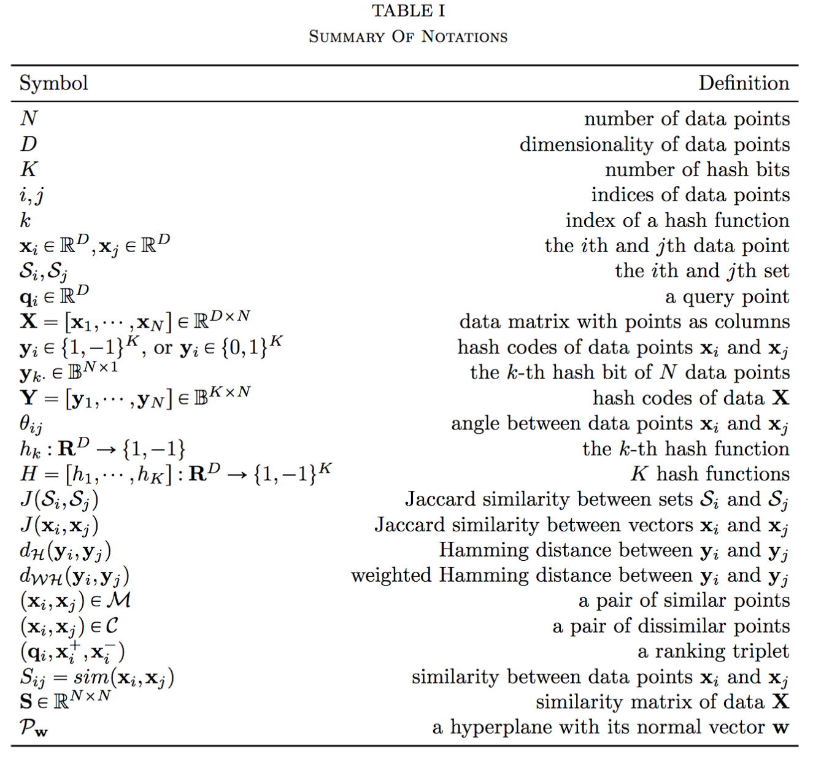
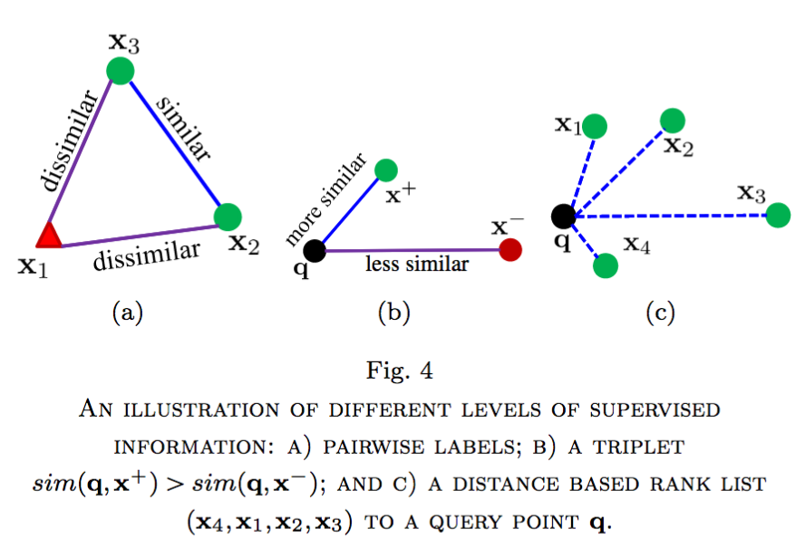
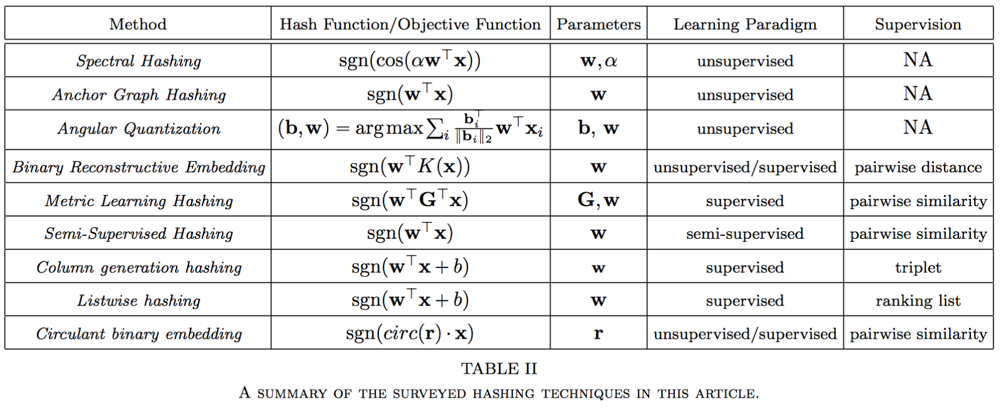
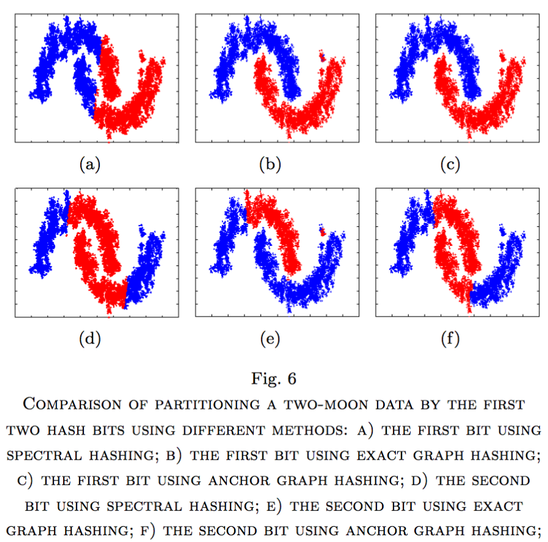
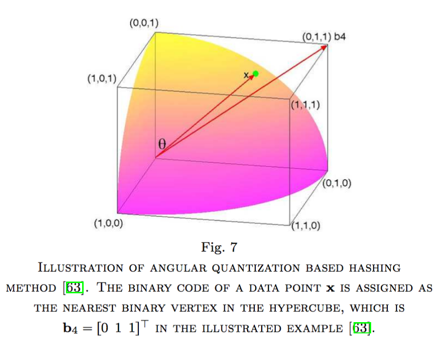
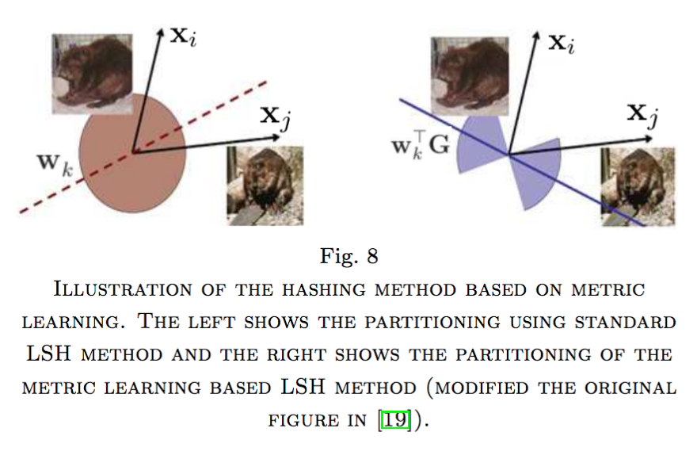
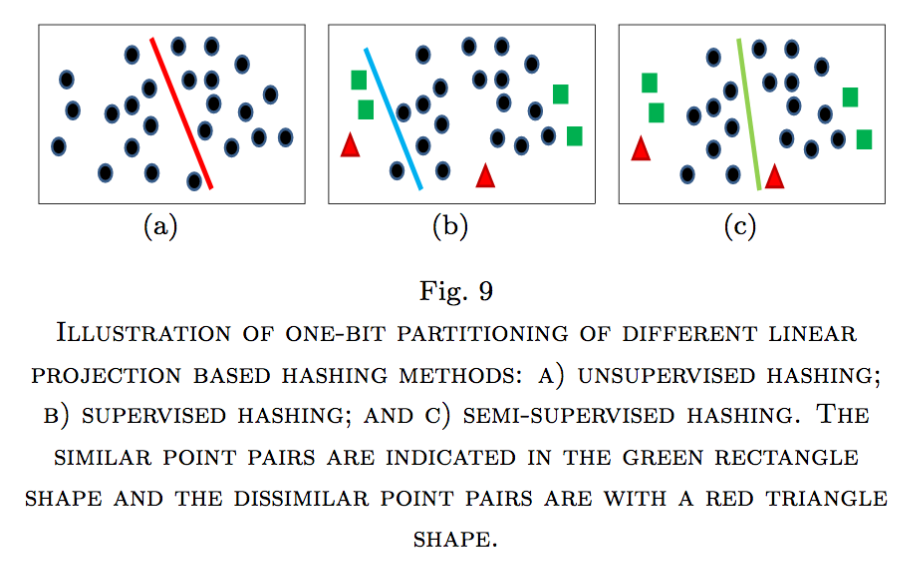
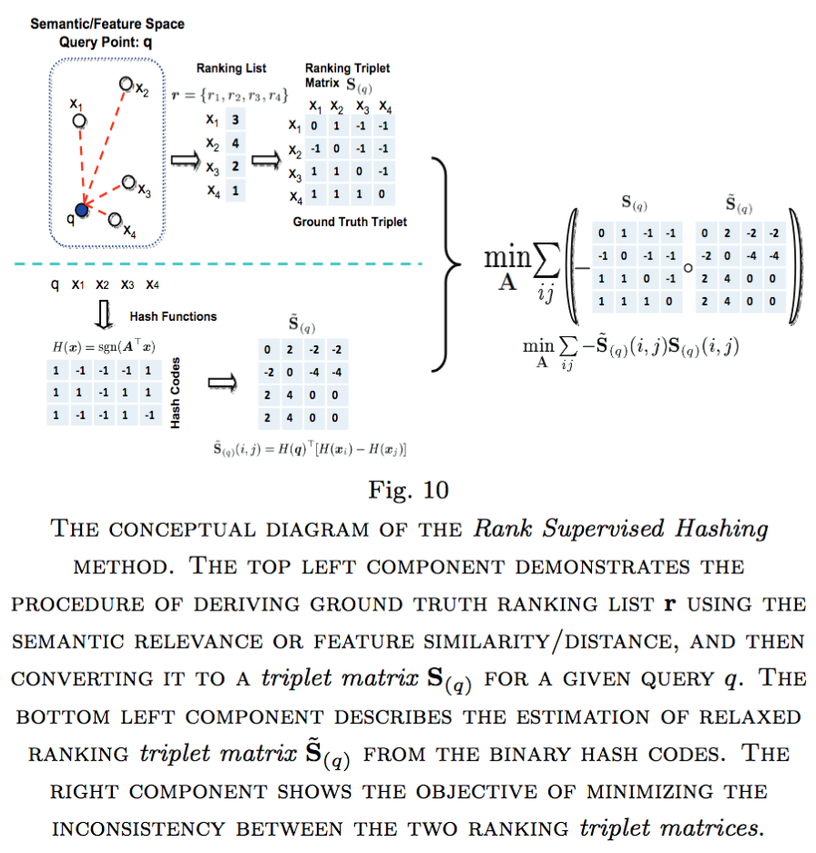
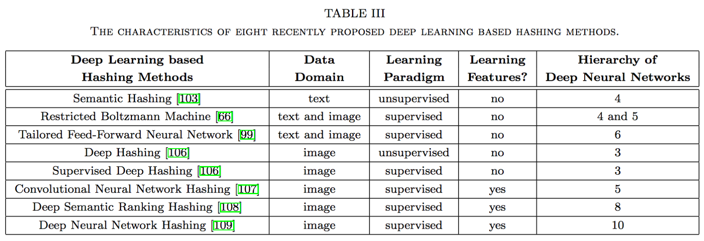
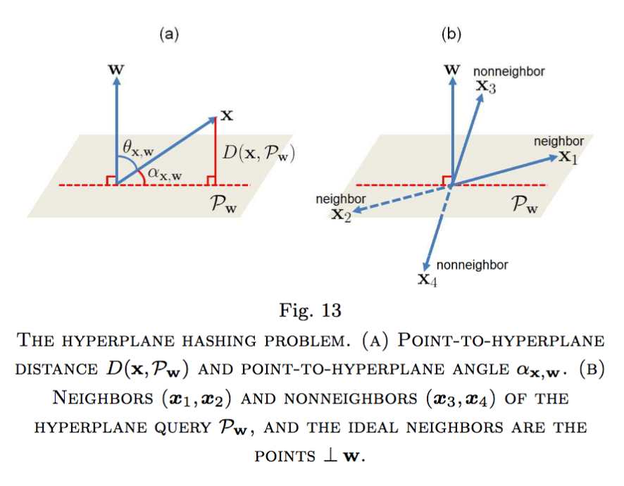

# [Paper reading] Learning to Hash for Indexing Big DataVA Survey

## Introduction
This is a survey paper about **learning to  hash**  framework  and  representative  techniques  of  various types, including **unsupervised, semi-supervised, and supervised**. 

----

## Background information

### Pipeline
1. Design hash functions
2. Generate hashcodes and indexing the database items
3. Online querying using hash codes

## Linear projection based

## Randomized Hashing
### Random Projection Based

### Random Permutation based Hashing

## Categories
A. Data-Dependent vs.  Data-Independen

B. Unsupervised, Supervised, and Semi-Supervised

C. Pointwise, Pairwise, Triplet-wise and Listwise

D. Linear vs. Nonlinear

E. Single-Shot Learning vs. Multiple-Shot Learning

F. Non-Weighted vs.  Weighted Hashing

## Prior methods

A.  Spectral Hashing

B.  Anchor Graph Hashing

C.  Angular Quantization Based Hashing

D.  Binary Reconstructive Embedding

E.  Metric Learning based Hashing

F.  Semi-Supervised Hashing

G.  Column Generation Hashing

H.  Ranking Supervised Hashin

I.  Circulant Binary Embedding

## Deep learning methods

## Advanced Methods
A.  Hyperplane Hashing

B.  Subspace Hashing

C.  MultiModality Hashing

## Applications
- image  search and retrieval
- patch matching, image classification, face recognition, pose estimation, object tracking, and duplicate detection
- cross-modality data fusion, large scale optimization, large scale classification and regression, collaborative filtering, and recommendation
